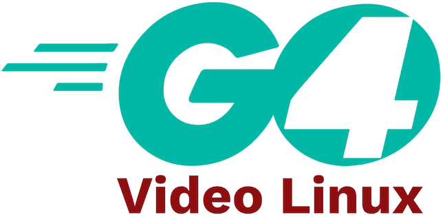

[](https://pkg.go.dev/github.com/vladimirvivien/go4vl) [](https://goreportcard.com/report/github.com/vladimirvivien/go4vl)

# go4vl



A Go centric abstraction of the library for  `Video for Linux 2`  (v4l2) user API.

----

The `go4vl` project is for working with the Video for Linux 2 API for real-time video. 
It hides all the complexities of working with V4L2 and provides idiomatic Go types, like channels, to consume and process captured video frames.

> This project is designed to work with Linux and the Linux Video API only.  It is *NOT* meant to be a portable/cross-platform package.

## Features

* Capture and control video data from your Go programs
* Idiomatic Go types such as channels to access and stream video data
* Exposes device enumeration and information
* Provides device capture control
* Access to video format information
* Streaming users zero-copy IO using memory mapped buffers

## Compilation Requirements

* Go compiler/tools
* Kernel minimum v5.10.x
* A locally configured C compiler (or a cross-compiler if building off-device)

See [example/README.md](./examples/README.md) for further example of how to build projects that uses go4vl, including cross-compilation.

All examples have been tested using a Raspberry PI 3, running 32-bit Raspberry PI OS.
The package should work with no problem on your 64-bit Linux OS.

## Getting started

### Using the go4vl package

To include `go4vl` in your own code, `go get` the package:

```bash
go get github.com/vladimirvivien/go4vl/v4l2
```

## Video capture example

The following is a simple example that shows how to capture a single frame from an attached camera device
and save the image to a file. 

The example assumes the attached device supports JPEG (MJPEG) output format inherently.

```go
func main() {
	dev, err := device.Open("/dev/video0", device.WithBufferSize(1))
	if err != nil {
		log.Fatal(err)
	}
	defer dev.Close()

	if err := dev.Start(context.TODO()); err != nil {
		log.Fatal(err)
	}

	// capture frame
	frame := <-dev.GetOutput()

	file, err := os.Create("pic.jpg")
	if err != nil {
		log.Fatal(err)
	}
	defer file.Close()

	if _, err := file.Write(frame); err != nil {
		log.Fatal(err)
	}
}
```

> See complete example [here](./examples/snapshot/snap.go).

## Examples
This repository comes with several examples that show how to use the API to build Go programs that can capture images from Linux.
> See list of [examples](./examples/README.md)

## Roadmap
The main goal is to port as many functionalities as possible so that 
adopters can use Go to create cool video-based tools on platforms such as the Raspberry Pi.