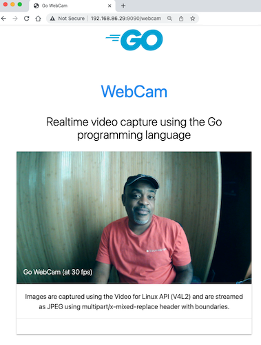

# Webcam example

The webcam examples shows how the `go4vl` API can be used to create a webcam that streams incoming video frames from an attached camera to a web page. The code sets up a web server that returns a web page with an image element that continuously stream the captured video from the camera.

## Running the example
Keep in mind that this code can only run on systems with the Linux operating system.
Before you can build and run the code, you must satisfy the following prerequisites.

### Pre-requisites

* Go compiler/tools
* Linux OS (32- or 64-bit)
* Kernel minimum v5.10.x or higher
* A locally configured C compiler (i.e. gcc)
* Header files for V4L2 (i.e. /usr/include/linux/videodev2.h)
* A video camera (with support for Video for Linux API)

If you are running a system that has not been upgraded in a while, ensure to issue the following commands:

```
sudo apt update
sudo apt full-upgrade
```

This example has been tested using a Raspberry Pi 3 running 32-bit Linux, with kernel version 5.14, with cheap USB video camera attached.

### Build and run

From within this directory, build with the following command:

```
go build -o webcam webcam.go
```

Once built, you can start the webcam with the following command (and output as shown):

```
 ./webcam
 
2022/05/21 09:04:31 device [/dev/video0] opened
2022/05/21 09:04:31 device info: driver: uvcvideo; card: HDM Webcam USB: HDM Webcam USB; bus info: usb-3f980000.usb-1.5
2022/05/21 09:04:31 Current format: Motion-JPEG [1920x1080]; field=any; bytes per line=0; size image=0; colorspace=Default; YCbCr=Default; Quant=Default; XferFunc=Default
2022/05/21 09:04:31 device capture started, frames available
2022/05/21 09:04:31 starting server on port :9090
2022/05/21 09:04:31 use url path /webcam
```

Next, point your browser to your machine's address and shown port (i.e. `http://198.162.100.20:9090`). 
You should see a webpage with the streaming video (see below.)



The webcam program offers several CLI arguments that you can use to configure the webcam:

```
./webcam --help
Usage of ./webcam:
  -d string
    	device name (path) (default "/dev/video0")
  -f string
    	pixel format (default "mjpeg")
  -h int
    	capture height (default 1080)
  -p string
    	webcam service port (default ":9090")
  -r int
    	frames per second (fps) (default 30)
  -w int
    	capture width (default 1920)
```

## The source code
The following code walk-through illustrates how simple it is to create programs that can stream video using the `go4vl` project.

Firstly, the `main` function opens the video device with a set of specified configurations (from CLI flags):

```go
var frames <-chan []byte

func main() {
    port := ":9090"
    devName := "/dev/video0"
    frameRate := 30
    
    // create device
	device, err := device.Open(devName,
	    device.WithIOType(v4l2.IOTypeMMAP),
	    device.WithPixFormat(v4l2.PixFormat{PixelFormat: getFormatType(format), Width: uint32(width), Height: uint32(height)}),
	    device.WithFPS(uint32(frameRate)), 
	)
}
```

Next, start the device and make the device stream available via package variable `frames`:

```go
var frames <-chan []byte

func main() {
...
	ctx, cancel := context.WithCancel(context.TODO())
	if err := device.Start(ctx); err != nil {
		log.Fatalf("stream capture: %s", err)
	}
	defer func() {
		cancel()
		device.Close()
	}()

	frames = device.GetOutput()

}
```

The last major step is to start an HTTP server to serve the video buffers, as images, and the page for the webcam:

```go
var frames <-chan []byte

func main() {
...

	// setup http service
	http.HandleFunc("/webcam", servePage)        // returns an html page
	http.HandleFunc("/stream", serveVideoStream) // returns video feed
	if err := http.ListenAndServe(port, nil); err != nil {
		log.Fatal(err)
	}
}
```

The video captured from the camera is served at endpoint `/stream` (see source above) which is serviced by HTTP handler
function `serveVideoStream`. The function uses a content type of `multipart/x-mixed-replace`, with a separate boundary for
each image buffer, that is rendered on the browser as a video stream.

```go
func serveVideoStream(w http.ResponseWriter, req *http.Request) {
	// Start HTTP Response
	const boundaryName = "Yt08gcU534c0p4Jqj0p0"

	// send multi-part header
	w.Header().Set("Content-Type", fmt.Sprintf("multipart/x-mixed-replace; boundary=%s", boundaryName))
	w.WriteHeader(http.StatusOK)

	for frame := range frames {
		// start boundary
		io.WriteString(w, fmt.Sprintf("--%s\n", boundaryName))
		io.WriteString(w, "Content-Type: image/jpeg\n")
		io.WriteString(w, fmt.Sprintf("Content-Length: %d\n\n", len(frame)))

		if _, err := w.Write(frame); err != nil {
			log.Printf("failed to write mjpeg image: %s", err)
			return
		}
		
		// close boundary
		if _, err := io.WriteString(w, "\n"); err != nil {
			log.Printf("failed to write boundary: %s", err)
			return
		}
	}
}
```

>See the full source code [here](./webcam.go)
